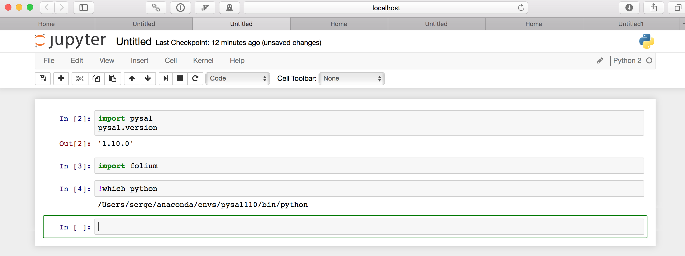
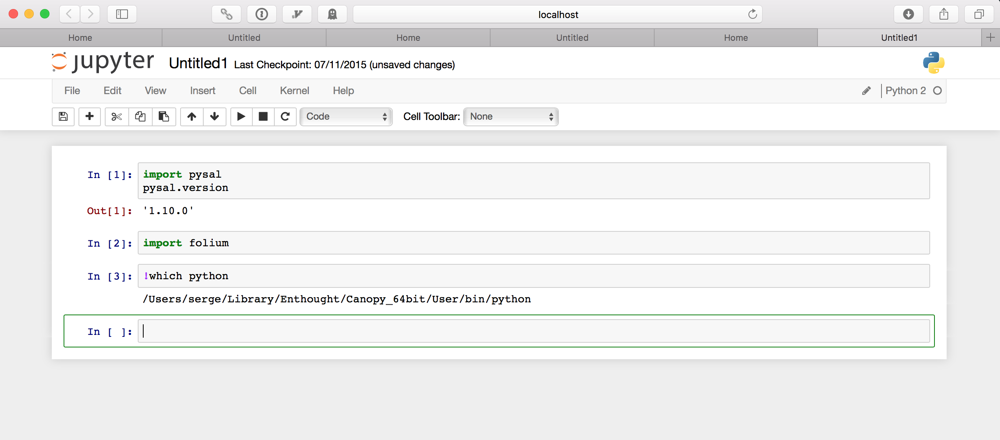

# Spatial Data Analysis with PySAL and GeoDaSpace

**[Sergio Rey] and [Luc Anselin]**

**November 11, 2015**

**NARSC  2015, Portland, Oregon**

## Tutorial Description

A unique feature of this tutorial is the use of Python based software tools for spatial data analysis. Python is an object oriented scripting language that is gaining rapid adoption in the scientific computing and data science communities. To facilitate its adoption within the GIScience community, Rey and Anselin have collaborated on the creation of [PySAL]: Python Library for Spatial Analysis. Since its initial release in July 2010, PySAL has been downloaded over 75,000 times and is now included in well- known open source scientific data analysis distributions, such as Anaconda. This two-part tutorial will introduce participants to the latest version of PySAL as well as to GeoDaSpace, a GUI application based on PySAL designed for spatial econometric analysis. The first component introduces the basic organization and philosophy of PySAL, with a special focus on exploratory spatial data analysis. In the second part of the tutorial the focus moves to practical spatial regression analysis using GeoDaSpace and the PySAL spreg module.

## Prerequisites

- Previous experience with Python programming is recommended
- Participants should bring their own laptops to the workshop
- Software should be installed prior to traveling to the workshop (instructions below)

### Software Requirements
** Please note that PySAL is pre-installed now  feb2016

For the workshop we will require the following packages be installed

- PySAL 1.10.0
- SciPy
- Numpy
- iPython 
- ipywidgets
- jupyter
- matplotlib
- pandas
- folium
- [GeoDaSpace][GeoDaSpace]

There are a number of ways to install PySAL and these dependencies. For the workshop, if you do not yet have the dependencies installed we suggest using one of two scientific Python distributions (below). These have the advantages of including most of the dependencies for PySAL as well as PySAL itself. Moreover, both allow for updating PySAL to the most recent release  (1.10 released July 31, 2015) which is more current that what is listed in either distribution. Both of these distributions also allow for installation of our final dependency, folium.

#### PySAL via Anaconda Python Distribution

1. Install [Anaconda Python Distribution][Anaconda]
2. Open a terminal (Mac or Linux) or Powershell (Windows)
2. `pip install -U pysal`
3. `pip install -U folium`

#### Creating a Custom Conda Environment

If you already have Anaconda installed and you did not want to modify your default environemnt, you can create a *custom conda environment* for this session using the following commands:

1. `conda create -n pysal110 scipy matplotlib jupyter ipython pandas ipywidgets`
2. `source activate pysal110`
4. `pip install -U pysal`
5. `pip install -U folium`

When you are done working in this environment, you can get back to your default environment with:

 `source deactivate`

#### PySAL via Enthought Canopy

Note that the Academic version of Canopy comes with PySAL version 1.7. For this workshop we will be using PySAL 1.10. Upgrading in Canopy can be done as follows:

1. Install [Canopy][Canopy]
2. Run Canopy
3. From the menu select `Tools Canopy Terminal`
4. `pip install -U pysal`
5. `pip install -U folium`

#### Testing Your Installation

Once you have installed all the dependencies, you can check to confirm everything is ready to go.

For Anaconda:

1. Open a terminal (Mac or Linux) or Powershell (Windows)
2. `ipython notebook`
3. In the browser click `New Notebook`
3. In the first cell in the notebook enter  
   `import pysal`
   `pysal.version`
   Then `<Shift-Enter>` (i.e., hit the Shift then the Enter Key)
4. In the second cell in the notebook enter  
   `import folium`
   Then `<Shift-Enter>`
5. In the third cell enter
   `!which python`
   Then `<Shift-Enter>`
 
Your screen should look something like:

For Enthought Canopy:

2. Run Canopy
3. From the menu select `Tools Canopy Terminal`
2. `ipython notebook`
3. In the browser click `New Notebook`
3. In the first cell in the notebook enter  
   `import pysal`
   `pysal.version`
   Then `<Shift-Enter>` (i.e., hit the Shift then the Enter Key)
4. In the second cell in the notebook enter  
   `import folium`
   Then `<Shift-Enter>`
5. In the third cell enter
   `!which python`
   Then `<Shift-Enter>`
 

Your screen should look something like:

#### Issues

If you run into any problems, double check that you have installed both the upgraded version of PySAL and folium (see above). If problems persist, please contact me <sjsrey@gmail.com>.

[PySAL]: http://pysal.org
[GeoDaSpace]: https://geodacenter.asu.edu/software/downloads/geodaspace
[Anaconda]: http://continuum.io/downloads.html
[Canopy]: https://www.enthought.com/store
[VirtualBox]: https://www.virtualbox.org/wiki/Downloads
[VirtualBox 4.3.12]: http://download.virtualbox.org/virtualbox/4.3.12/VirtualBox-4.3.12-93733-Win.exe
[Vagrant]: http://www.vagrantup.com/downloads.html
[Vagrantfile]: Vagrantfile
[Sergio Rey]: https://geoplan.asu.edu/people/sergio-j-rey
[Luc Anselin]: https://geoplan.asu.edu/people/luc-anselin
